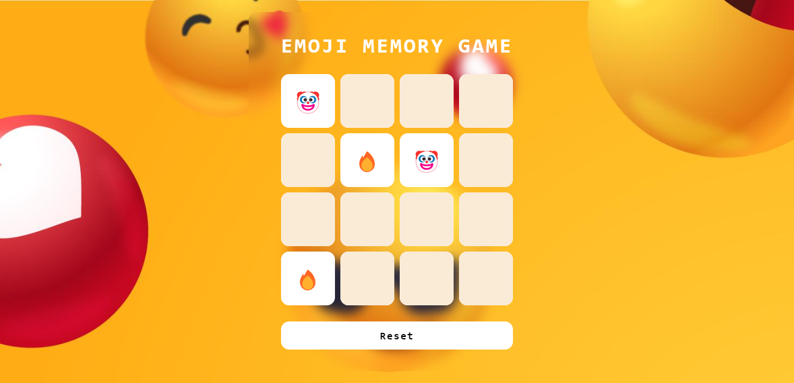

# Emoji Memory Game

    

Pequeno projeto criando um jogo da memória usando caracteres de emojis como ilustrações feito com Javascript é o 2º dos 4 projetos do Bootcamp Potência Tech iFood - Desenvolvimento de Jogos.

### Tecnologias Utilizadas

- HTML5 e CSS3 para a estrutura e aparência do jogo;
- JavaScript para a lógica de programação e interações;
- Imagem de background utilizada está disponível em <a href="https://www.freepik.com/free-vector/positive-reactions-with-empty-space-background_10503421.htm#query=emoji%20background&position=2&from_view=keyword&track=ais&uuid=c46f82c1-1712-4de4-b8e0-384c6e5e85c7">freepik.com</a>

  ### Como Jogar

  - Clique em duas cartas, você deve encontrar o par da primeira carta selecionada;
  - Ao encontrar todos os pares, você vence o jogo e poderá reiniciar clicando no botão de reset no canto inferior da página.

### Modificações

- Adição de um favicon;
- Favicon aleatório a cada reload na página;
- Alteração na identidade visual e nos emojis selecionados.

### Contribuições

Sintam-se livres para adicionar recursos, corrigir problemas, polir o código ou usá-lo de referência.

### Créditos

Este jogo foi desenvolvido como parte de um projeto educacional da Digital Innovation One em parceria com o iFood para o Bootcamp Potência Tech iFood - Desenvolvimento de Jogos. 

---

Não se esqueça de visitar o <a href="https://github.com/digitalinnovationone/js-emoji-memory-game">repositório original da DIO</a> e deixar uma ⭐️ caso goste.
